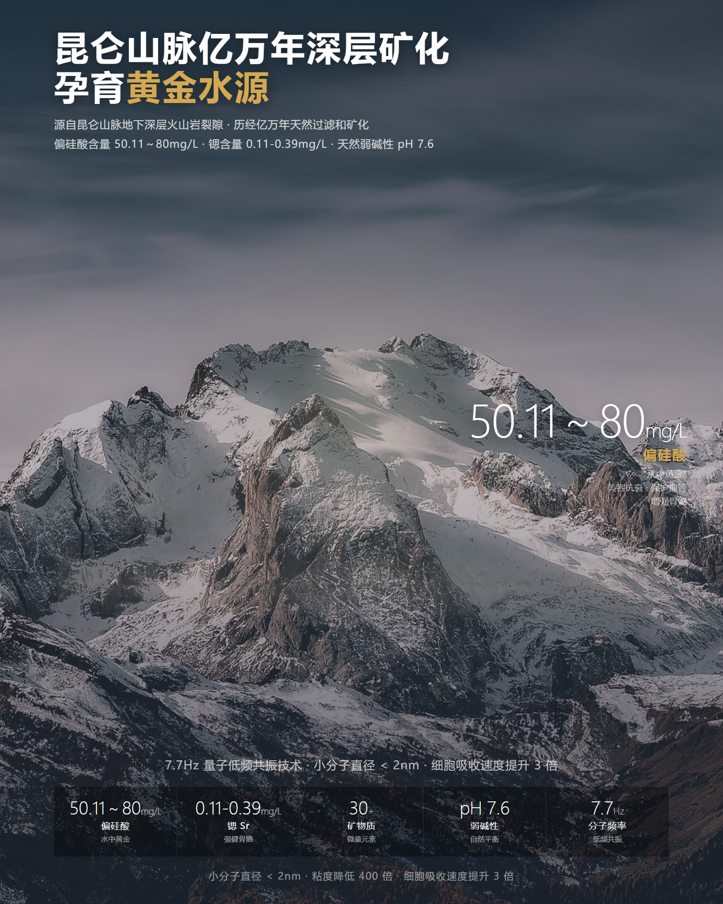

# Examples

## 7.7Hz 小分子天然矿泉水 · 便利店海报

80×100cm 易拉宝，百岁山风格布局。昆仑山背景 + 瓶身居中 + 右侧核心指标 + 底部 5 列数据矩阵。

**设计要点：**
- 冷蓝灰渐变遮罩，中部提亮形成聚光
- 暖色光晕 + 光线 + 地面雾气 3 层融合
- 金色 (#d4a853) 点缀"黄金水源" + 偏硅酸数据
- 底部 5 列数据矩阵建立可信度

---

More examples coming soon. Want to contribute yours? PR welcome.
